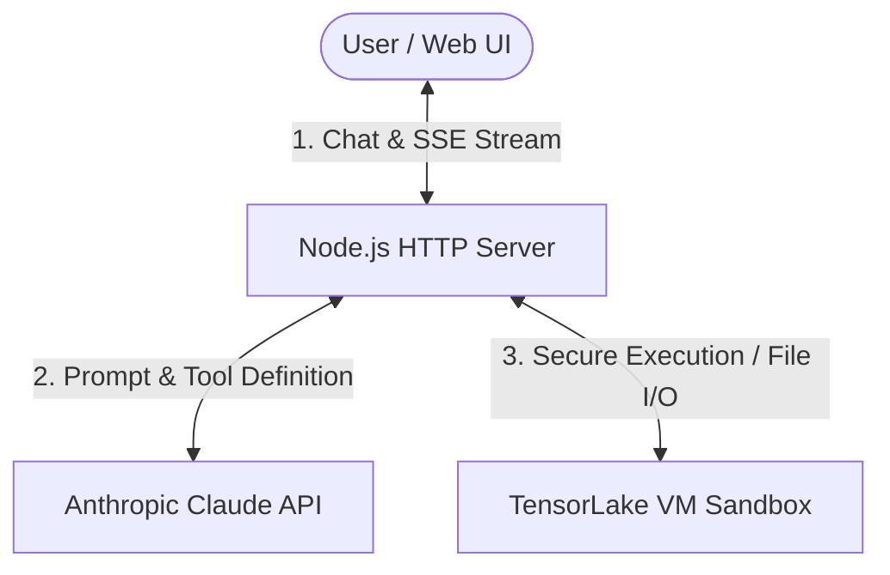

# Sandbox Agent

An AI-powered coding assistant that can run code, execute shell commands, and manage files within a secure, isolated Linux sandbox. Built with Node.js, TypeScript, Anthropic SDK, and TensorLake.

## Summary

This project implements a web application and server-side agent loop:
- **Frontend UI**: A clean, single-page interface (`public/index.html`, `public/app.js`) to chat with the agent and download exported files.
- **Node.js Server**: A HTTP server that serves static files and provides a `/api/chat` Server-Sent Events (SSE) endpoint to stream agent thoughts and tool outputs.
- **Agent Loop**: Integrates the Anthropic SDK (`claude-3-5-sonnet`) with custom tools using schema validation via `zod`.
- **Isolated Execution**: Leverages TensorLake's secure sandboxes to safely write, read, run code (Python, JS, TS, Bash), and export generated files.

## Demo


https://github.com/user-attachments/assets/eb9fefa2-7a20-42e6-87fa-ab18b0159874


## Architecture



## Setup Guide

### Prerequisites
- Node.js (v18+ recommended)
- `pnpm` (recommended package manager)
- An Anthropic API Key
- A TensorLake API Key

### Installation

1. Clone or open the project folder.
2. Install the dependencies:
   ```bash
   pnpm install
   ```

3. Copy the environment variables example file and fill in your keys:
   ```bash
   cp .env.example .env
   ```
   *Note: Edit `.env` to supply your valid `ANTHROPIC_API_KEY` and `TENSORLAKE_API_KEY`.*

### Running the Application

To start the development server with automatic file watching:
```bash
pnpm run dev
```

To run formatting or linting checks:
```bash
# Format codebase using Prettier
pnpm run format

# Run ESLint check
pnpm run lint
```

Once running, navigate to [http://localhost:3000](http://localhost:3000) to chat with the agent and test its code execution capabilities.
